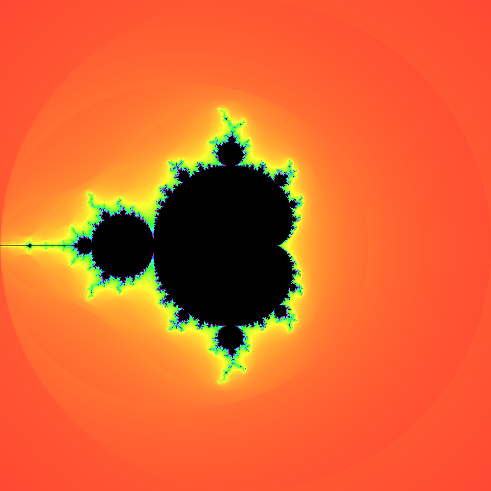
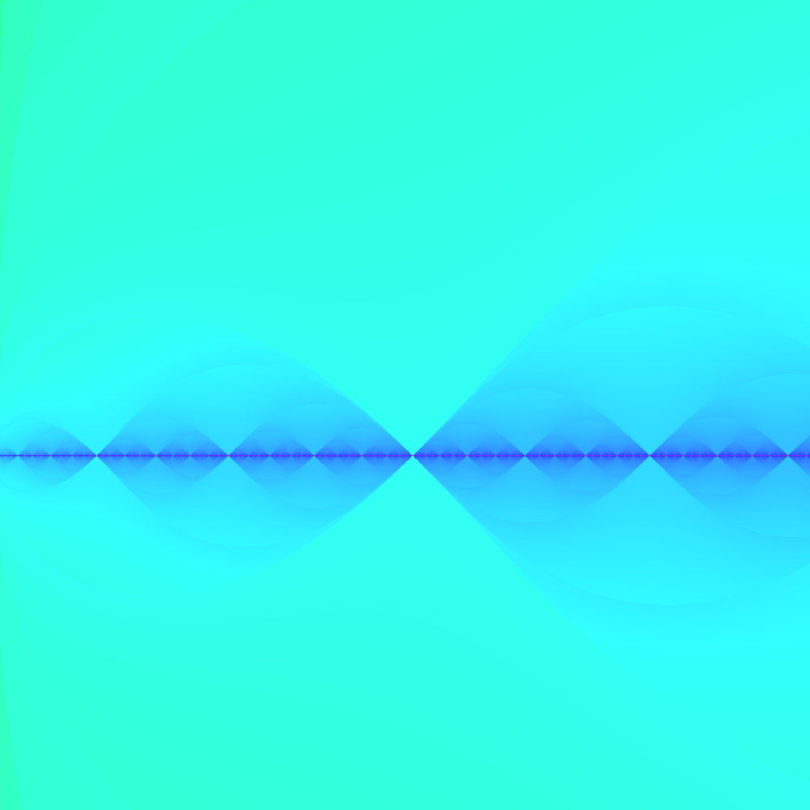
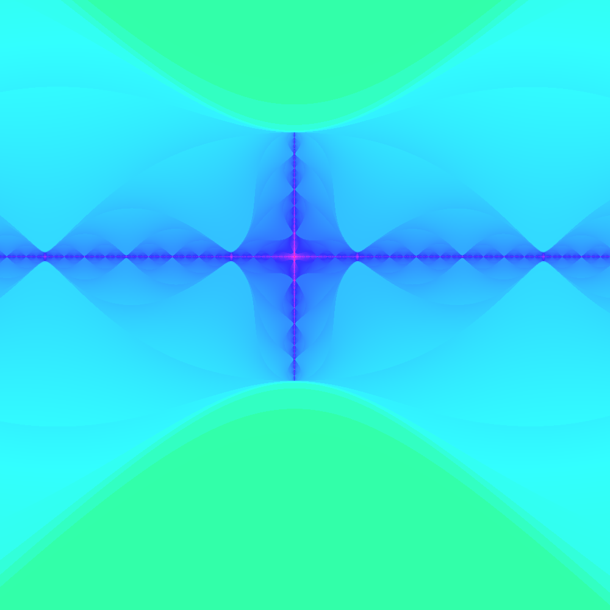
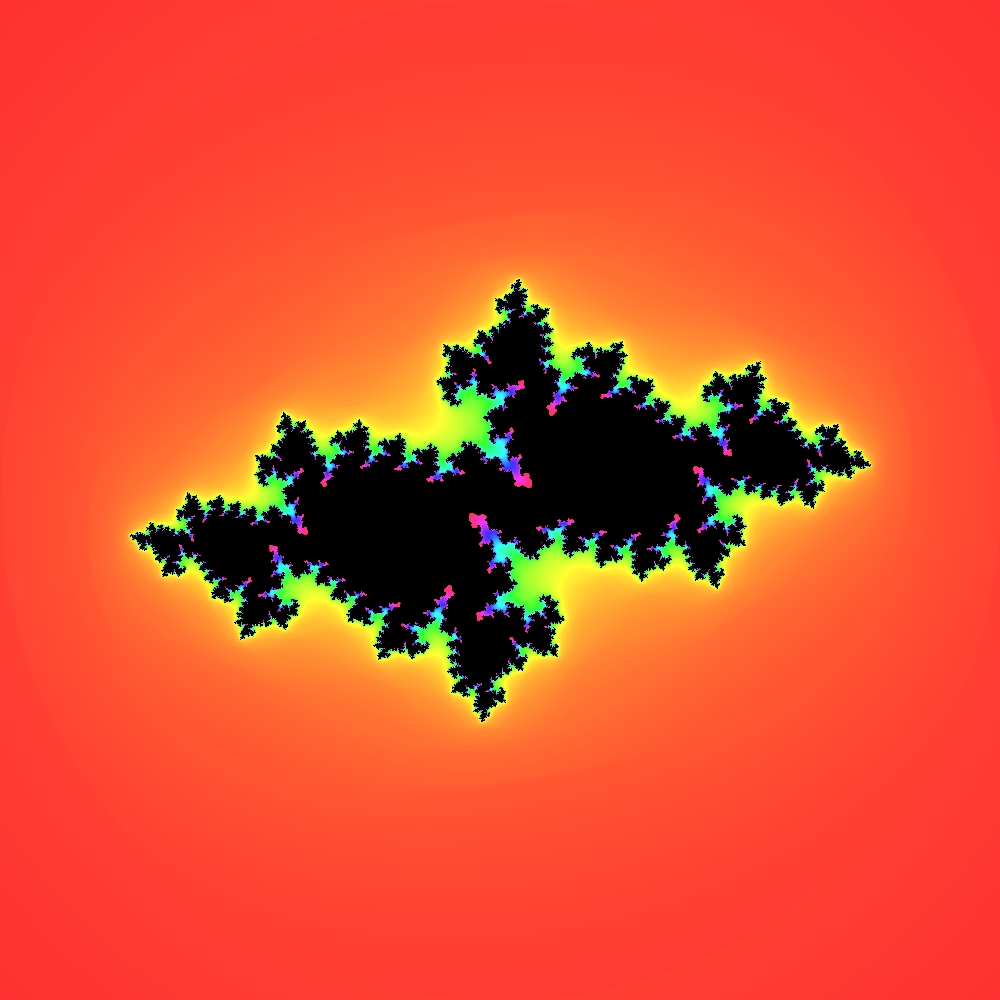

# Fractal Visualizer
This is a Mandelbrot/Julia Set visualizer written in Rust and JavaScript for the web.

## Features
- Zoom in and out
- Move around
- Change iteration count
- Save images
- Switch between Mandelbrot and Julia sets

## Images

  
  
  
  

